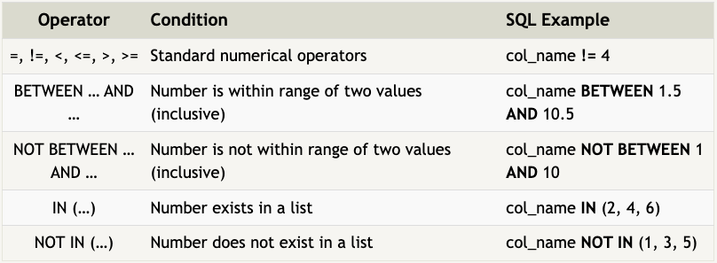
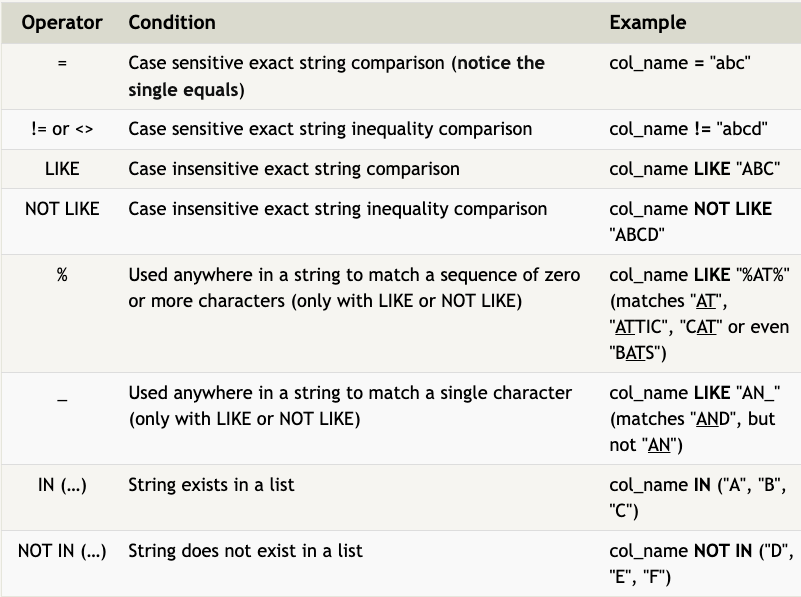

# SQL 
source: sqlbolt.com

SQL (**Structured Query Language**) is a language designed to allow users to query, manipulate and transform data from a relational database.

A **relational database** represents a collection of related (two-dimensional) tables.

Each of the **tables** are similar to an Excel spreadsheet, with a fixed number of named columns (the attributes or properties of the table) and any number of rows (entity, instance) of data.

Some SQL databases: SQLite, MySQL, PostgresQL, Oracle and Microsoft SQL Server.
SQL databases provide safe and scalable storage for millions of websites and mobile applications.

### SELECT queries

A **query** in itself is just a statement which declares what data we are looking for, where to find it in the database, and optionally, how to transform it before it is returned.

Select query for a specific columns: 
```
SELECT column, another_column
FROM mytable;
```

To retrieve all the columns of data from the table:
```
SELECT * 
FROM mytable;
```

#### Queries with constraints

In order to filter certain results from being returned, we need to use a **WHERE** clause in the query. The clause is applied to each row of data by checking specific column values to determine whether it should be included in the results or not. 

It makes the result **more managable to understand**, and allows the query **run faster** due to the reduction in unnecessary data being returned. 
```
SELECT column, another_column
FROM mytable
WHERE condition
  AND/OR another_condition
  AND/OR ...;
```

Below are some useful operators that you can use for numerical data (ie. **integer or floating point**):



SQL supports a number of useful **text-data specific operators** (**case-insensitive string comparison, wildcard pattern matching**):  



All strings must be quoted so that the query parser can distinguish words in the string from SQL keywords.


**DISTINCT** keyword: provides a convenient way to discard rows that have a duplicate column value, it gives a unique result.

```
SELECT DISTINCT column, another_column
FROM mytable
WHERE condition;
```

SQL provides a way to sort your results by a given column in ascending or descending order using the **ORDER BY** clause. When an ORDER BY clause is specified, each row is sorted alpha-numerically based on the specified column's value.
```
SELECT column, another_column
FROM mytable
WHERE condition(s)
ORDER BY column ASC/DESC;
```
Another clause which is commonly used with the ORDER BY clause are the **LIMIT** and **OFFSET** clauses, which are a useful optimization to indicate to the database the subset of the results you care about. 

**The LIMIT will reduce the number of rows to return, and the optional OFFSET will specify where to begin counting the number rows from.**
```
SELECT column, another_column
FROM mytable
WHERE condition(s)
ORDER BY column ASC/DESC
LIMIT num_limit OFFSET num_offset;
```


### SQL Schema 
In SQL, the database **schema** is what describes the structure of each table, and the datatypes that each column of the table can contain. (e.g. year column must be an Integer, title column must be a String). 

A table is a two-dimensional set of rows and columns, with the columns being the properties and the rows being instances of the entity in the table. 

### Inserting rows
When inserting data into a database, each row of data you insert should contain values for every corresponding column in the table. You can insert multiple rows at a time by just listing them sequentially.
```
INSERT INTO mytable
VALUES (value_or_expr, another_value_or_expr, ...),
    (value_or_expr2, another_value_or_expr2, ...);


INSERT INTO boxoffice
 (movie_id, rating, sales_in_millions)
 VALUES (1, 9.9, 283);
```

### Updating rows

Updating data. You have to specify exactly which table, columns and rows to update. 
```
UPDATE mytable
SET column = value_or_expr,
    other_column = another_value_or_exp,
    ...
WHERE condition;
```
WHERE clause: important to use, always write the constraint first and test it in a SELECT query to make sure you are updating the right rows. Otherwise you can update all rows by mistake. 

### Deleting rows
```
DELETE FROM mytable
WHERE condition;
```
If you leave out WHERE constraint, then all rows are removed, it clears out a table completely.

Tip: before you delete, run the constraint in a SELECT query first to ensure you are removing the right rows. 


### Creating table

```
CREATE TABLE IF NOT EXISTS mytable (
    column DataType TableConstraint DEFAULT default_value,
    another_column DataType TableConstraint DEFAULT default_value,
    …
);
```
If there already exists a table with the same name, the SQL implementation will usually throw an error, so to suppress the error and skip creating a table if one exists, you can use the IF NOT EXISTS clause.

#### Data types

- INTEGER: whole integer values / BOOLEAN: 0 or 1

- FLOAT, DOUBLE, REAL: more precise numerical data

- CHARACTER, VARCHAR, TEXT: text based datatypes 

- DATE, DATETIME 

- BLOB: sql store binary data in blobs

#### Table Constraints 

Each column can have additional table constraints on it which limit what values can be inserted into that column. 

- PRIMARY KEY: The values in this column are unique, and each value can be used to identify a single row in this table.

- AUTOINCREMENT: The value is automatically filled in and incremented with each row insertion

- UNIQUE: Values in this column have to be unique, so you can't insert another row with the same value in this column

- NOT NULL: The inserted value can not be NULL.

- CHECK (expression): This allows you to run a more complex expression to test whether the values inserted are valid. For example, you can check that values are positive, or greater than a specific size, or start with a certain prefix, etc.

- FOREIGN KEY: This is a consistency check which ensures that each value in this column corresponds to another value in a column in another table.


#### Example
```
CREATE TABLE movies (
    id INTEGER PRIMARY KEY,
    title TEXT,
    director TEXT,
    year INTEGER, 
    length_minutes INTEGER
);
```

### Altering tables

```
ALTER TABLE mytable;
```

It provides a way to update the corresponding tables and database schemas by using the ALTER TABLE statement to add, remove or modify columns and table constraints.

#### Adding columns
```
ALTER TABLE mytable
ADD COLUMN ColumnName DataType DEFAULT default_value;
```
#### Removing columns
```
ALTER TABLE mytable
DROP column_to_be_deleted;
```

#### Renaming the table
```
ALTER TABLE mytable
RENAME TO new_table_name;
```
### Remove table

```
DROP TABEL IF EXISTS mytable;
``` 
To remove an entire table including all of its data and metadata. It also removes the table schema from the database entirily. (Compare to DELETE)

**IF EXISTS**  clause: the database may throw an error if the specified table does not exists and to avoid this error we use IF EXISTS clause. 

In addition, if you have another table that is dependent on columns in table you are removing (for example, with a FOREIGN KEY dependency) then you will have to either update all dependent tables first to remove the dependent rows or to remove those tables entirely.

